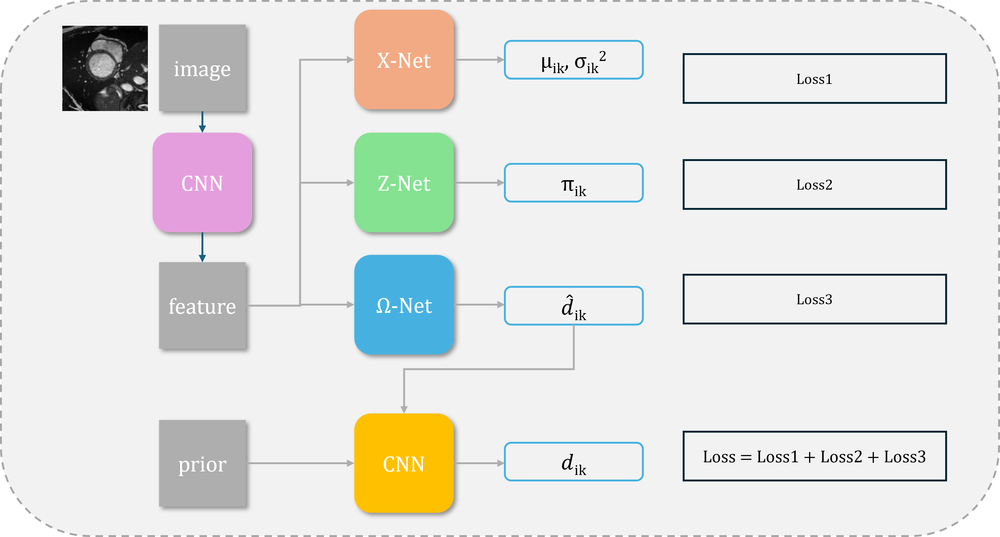

# 1 Introduction
心脏磁共振成像（Cardiac Magnetic Resonance, CMR）能够提供高分辨率、无辐射的心脏结构与功能信息，是评估心室容积、心肌质量、射血分数和局部壁运动异常等关键指标的重要工具 [5, 8]。这些定量指标的准确性高度依赖于对左心室（LV）、右心室（RV）以及心肌（MYO）的精确分割，因此，如何在不同中心、不同设备和不同人群条件下获得稳定、可靠的心脏分割结果，一直是医学图像分析领域的核心问题 [5]。

随着深度学习的发展，全监督的 U-Net 及其变体已经在多个心脏分割基准数据集上取得了接近专家水平的性能 [1, 5]。然而，这类方法通常需要大量逐像素标注的训练样本，而心脏 MRI 的像素级标注极为耗时，往往需要经验丰富的心血管影像专家对每个切片进行细致描绘，标注成本高且存在较强主观性。受限于临床工作量和数据共享政策，在真实应用场景中可获得的高质量标注数据通常十分有限，这成为制约全监督方法进一步推广的重要瓶颈。

为缓解标注不足的问题，近几年大量半监督医学图像分割方法被提出，通过一致性约束、伪标签生成、教师–学生框架或协同训练机制充分利用未标注数据 [7, 11–16]。例如，SS-Net 通过同时建模像素级平滑性与类别间分离性，在少量标注数据下取得了优异的心脏分割性能 [11]；DC-Net 通过解耦一致性正则，将高置信与低置信预测分别建模，从而更加充分地利用未标注样本 [12]；ABD 则基于自适应双向位移设计多种扰动形式以增强一致性学习效果 [13]。近期的 LSRL-Net、beta-FFT 和 ALHVR 等方法进一步从层级重学习、频域插值以及高价值区域自适应学习等角度对半监督框架进行了改进，在 ACDC、M&Ms 等数据集上持续刷新性能上限 [14–16]。

尽管上述半监督方法取得了显著进展，它们仍然存在两个根本局限。首先，这类方法在训练阶段都需要一定比例的目标域标注数据（通常为 5%–20% 体积级标注），以构建基础监督信号 [11–16]。在新的医院或新的疾病队列上部署时，仍需重新标注一批目标域样本，难以真正摆脱对昂贵标注的依赖。其次，大多数方法是在单一数据集或轻度域移条件下设计和验证的，当面对扫描仪品牌、成像协议或患者人群显著变化时，模型的泛化性能往往明显下降 [6, 8, 9]。尤其是在完全缺乏目标域标注的跨域场景中，现有半监督方法通常难以直接迁移。

另一些工作尝试从无监督角度进行图像分割：一类方法基于经典高斯混合模型（Gaussian Mixture Model, GMM）或 k-means 聚类，仅利用像素强度或浅层特征进行聚类 [3]；另一类方法将 GMM 与深度网络结合，通过网络直接预测 GMM 参数并最小化负对数似然，实现端到端的无监督分割 [10]。例如 DeepGMM 在心肌梗死等任务上展示了深度先验与混合模型结合的潜力 [10]。然而，这些无监督方法通常仍然主要依赖局部强度分布，对心脏结构在空间上稳定的解剖先验建模不足，难以在多中心、多疾病队列中获得与半监督方法可比的性能 [8, 9]。

综上所述，如何在完全不使用目标域标注数据的前提下，充分利用少量辅助数据集构建的解剖先验，并在多数据集、多中心条件下实现稳定可靠的心脏分割，仍是一个尚未充分解决的重要问题。为此，本文提出一种基于高斯混合模型的无监督心脏分割框架 GmmSeg，将深度特征表示、变分贝叶斯推断与解剖 Dirichlet 先验有机结合。本文的核心思想在于：利用一个小规模带标注的辅助数据集（如 ACDC）学习统计意义上的心脏解剖先验，并通过可学习配准网络将该先验对齐到任意新的目标域数据上，从而在完全无标注的目标域中实现高质量分割。

本文的主要贡献概括如下：

1. 提出了一个面向心脏 MRI 的无监督分割框架 GmmSeg，在深度特征空间中构建逐像素 GMM，并在变分贝叶斯框架下联合优化混合权重和高斯参数，实现对分割结果不确定性的显式建模。
2. 设计了基于 Dirichlet 分布的解剖先验建模与配准策略，利用少量标注的辅助数据集构建跨域可迁移的概率先验，并通过刚性配准网络将其对齐到不同目标域，实现真正“目标域零标注”的心脏分割。
3. 在 ACDC、M&Ms、SCD 和 YORK 四个公开数据集上的实验表明，在完全无监督设定下，GmmSeg 在多个指标上已可与甚至超过使用 5%–25% 标注数据训练的代表性半监督方法（如 SS-Net、DC-Net、ABD、LSRL-Net、beta-FFT 和 ALHVR）相当，尤其在跨域泛化能力方面表现突出，验证了“深度特征 + GMM + 解剖先验”这一建模范式的有效性。

# 2 Method

图 1 展示了 GmmSeg 的整体框架。本研究提出了一种基于高斯混合模型（Gaussian Mixture Model, GMM）的心脏图像分割框架 GmmSeg，将深度特征表示与变分贝叶斯推断相结合，以显式刻画分割结果的不确定性并融入解剖先验约束。整体流程包括：图像对齐与尺度归一、特征提取、逐像素 GMM 建模、先验引导的 Dirichlet 加权以及基于变分证据下界（Evidence Lower Bound, ELBO）的优化目标。

从整体架构上看，GmmSeg 由三个相互衔接的子模块组成：（1）**几何对齐与尺度归一模块**，通过浅层卷积网络预测每张输入切片的旋转、平移与缩放参数，并据此在图像空间实施刚性/仿射变换，使不同病人和不同数据集的心脏区域在空间上初步对齐；（2）**特征提取与解码模块**，采用 U-Net 风格的编码器–解码器结构，将对齐后的二维切片映射到多通道高维特征图，该特征图同时兼顾局部纹理与全局形状信息；（3）**GMM 参数预测与先验加权模块**，在共享特征图上附加三个轻量卷积分支，分别输出每个像素在各分量上的高斯均值与方差向量、混合权重以及 Dirichlet 浓度参数，并利用从辅助数据集构建的解剖先验对这些参数进行正则化与加权。整个网络通过负 ELBO 损失进行端到端训练。该节后续将依次介绍像素级 GMM 建模（第 2.1 节）、解剖先验与配准建模（第 2.2 节）、变分后验与责任分配（第 2.3 节）、目标函数及其组成（第 2.4 节），以及整体训练流程（第 2.5 节）。

## 2.1 像素级 GMM 建模

设输入为二维心脏影像，经预处理后大小统一为 $H\times W$。对每个像素 $i\in\{1,\dots,N\}$（$N=H\times W$），由特征提取网络得到一个 $C$ 维特征向量 $\boldsymbol{x}_i\in\mathbb{R}^C$，记所有像素特征集合为 $\boldsymbol{x}=\{\boldsymbol{x}_i\}_{i=1}^N$。我们假设每个 $\boldsymbol{x}_i$ 由 $K$ 分量的高斯混合模型生成，并通过隐变量 $z_i=(z_{i1},\dots,z_{iK})$ 表示像素属于第 $k$ 个解剖结构分量的指派，其中

$$
z_{ik}\in\{0,1\},\qquad \sum_{k=1}^K z_{ik}=1.
$$

在给定混合权重和高斯参数 $\Omega=\{\boldsymbol{\mu}_{ik},\boldsymbol{\sigma}_{ik}^2\}$ 的条件下，观测似然写为

$$
P(\boldsymbol{x} \mid z,\Omega) 
= \prod_{i=1}^N \prod_{k=1}^K 
\mathcal{N}\bigl(\boldsymbol{x}_i \mid \boldsymbol{\mu}_{ik}, \boldsymbol{\Sigma}_{ik}\bigr)^{z_{ik}}.
$$

其中，$\boldsymbol{\mu}_{ik}\in\mathbb{R}^C$ 和 $\boldsymbol{\Sigma}_{ik}$ 分别为第 $i$ 个像素在第 $k$ 个混合分量上的均值与协方差矩阵；记 $\Sigma_{ik}=\operatorname{diag}(\boldsymbol{\sigma}_{ik}^2)\in\mathbb{R}^{C\times C}$。

## 2.2 Dirichlet 参数先验

为显式融入跨病例稳定的解剖先验，本工作首先在一个小规模带标注的辅助数据集（如 ACDC 训练集）上构建经验解剖概率图。具体而言，将所有带标注样本配准到一个共同参考空间，并对每个像素位置统计其被标注为各个解剖类别的相对频率，从而得到先验概率 $\tilde{p}_{ik}$，表示在标准空间下像素 $i$ 属于第 $k$ 类的经验概率。为避免某些类别概率过于接近 0 或 1，实际构建时可对频率图做适度平滑与截断处理。我们将 $\tilde{p}_{ik}$ 转化为 Dirichlet 先验的浓度参数

$$
d_{ik}^{(0)} = \lambda \,\tilde{p}_{ik},
$$

其中 $\lambda>0$ 为强度超参数，用于控制先验对后验的约束程度。

考虑到测试样本与先验模板在尺度和平移上的差异，我们引入基于残差网络的配准模块 $f_{\text{reg}}$，其输入为当前样本的预测后验权重图与先验概率图的拼接特征，输出刚性缩放与平移参数 $\phi=(s,t_x,t_y)$。通过仿射变换算子 $\mathcal{T}_{\phi}$ 将先验图映射到当前图像空间，得到配准后的先验

$$
d_{ik} = \lambda \,\mathcal{T}_{\phi}\bigl(\tilde{p}_{ik}\bigr),
$$

从而构成逐像素的 Dirichlet 先验 $P(\Omega)=\prod_i \operatorname{Dir}(d_i)$。在训练过程中，$d_{ik}$ 作为先验超参数参与后续的 KL 正则，而配准参数 $\phi$ 以无梯度方式迭代更新，仅依赖于当前样本和预测的后验权重，从而避免对先验网络本身的过拟合。

## 2.3 变分推断与目标函数

在变分贝叶斯框架下，我们对联合后验 $P(z,\Omega\mid \boldsymbol{x})$ 采用 mean-field 分解

$$
q(z,\Omega\mid \boldsymbol{x}) = q(z\mid \boldsymbol{x})\,q(\Omega\mid \boldsymbol{x}),
$$

其中：

1. **隐变量后验 $q(z\mid \boldsymbol{x})$**  
	将 $q(z\mid \boldsymbol{x})$ 设为逐像素独立的分类分布

$$
q(z\mid \boldsymbol{x})=\prod_{i=1}^N\prod_{k=1}^K \pi_{ik}^{z_{ik}},\qquad 
\sum_k\pi_{ik}=1,
$$

其中 $\pi_{ik}$ 由 $z_\text{net}$ 预测，可理解为像素 $i$ 属于分量 $k$ 的软分割概率。

2. **参数后验 $q(\Omega\mid \boldsymbol{x})$**  
   混合权重采用 Dirichlet 后验

$$
q(\Omega\mid \boldsymbol{x}) = \prod_{i=1}^N \operatorname{Dir}\bigl(\hat d_i\bigr) = \prod_{i=1}^N Z_{Dir}(\hat d_i) \prod_{k=1}^K \omega_{ik}^{\hat d_{ik}-1},
$$

其中 $\hat d_{ik}$ 由 $o_\text{net}$ 预测。高斯均值与方差由 $x_\text{net}$ 给出，视作近似后验的参数化表示。

在训练过程中，我们采用变分推断的方法，优化变分证据下界（ELBO）作为目标函数。通过最大化 ELBO，我们能够同时优化 GMM 的参数和 Dirichlet 分布的超参数，从而实现对心脏结构的准确分割。下面给出变分目标的具体形式，其中 $\boldsymbol{x}$ 表示所有观测特征的集合。

训练过程中，我们通过最小化负 ELBO 来学习网络参数。记联合先验

$$
P(z,\Omega)=P(z\mid\Omega)\,P(\Omega),
$$

其中 $P(z\mid\Omega)$ 由混合权重给出，服从分类分布
$$
P(z\mid\Omega) = \prod_{i=1}^N\prod_{k=1}^K \omega_{ik}^{z_{ik}}, \qquad \sum_k z_{ik} = 1,
$$

$P(\Omega)$ 为前述 Dirichlet 先验

$$
P(\Omega) = \prod_{i=1}^N \operatorname{Dir}(d_i) = \prod_{i=1}^N Z_{Dir}(d_i) \prod_{k=1}^K \omega_{ik}^{d_{ik}-1}.
$$

ELBO 定义为

$$
\operatorname{ELBO} 
= \mathbb{E}_q[\log P(\boldsymbol{x}\mid z,\Omega)] - \operatorname{KL}\bigl(q(z,\Omega\mid \boldsymbol{x})\,\Vert\,P(z,\Omega)\bigr),
$$

我们最小化其相反数

$$
\mathcal{L} = -\operatorname{ELBO}
= \mathcal{L}_1 + \mathcal{L}_2 + \mathcal{L}_3,
$$

并在实现中加入适度正则化项。各项含义如下。

### 2.4.1 重构项 $\mathcal{L}_1$：数据似然约束

利用 $\mathbb{E}[z_{ik}]=\pi_{ik}$，有

$$
\mathcal{L}_1
	= -\mathbb{E}_{q(z,\Omega)}[\log P(\boldsymbol{x}\mid z,\Omega)]
	= - \sum_{i=1}^N \sum_{k=1}^K \pi_{ik} \Big( - \tfrac{(x_i-\mu_{ik})^2}{2\sigma_{ik}^2} - \tfrac{1}{2}\log 2\pi - \log \sigma_{ik} \Big).
$$

在实现中可将对数高斯似然进一步拆解为均值相关项与方差相关项，分别监控重构误差在 $\boldsymbol{\mu}$ 与 $\boldsymbol{\sigma}^2$ 维度上的贡献，以利于数值稳定性与训练诊断。

### 2.4.2 隐变量 KL 项 $\mathcal{L}_2$：类别分布约束

隐变量后验 $q(z\mid \boldsymbol{x})$ 与先验 $P(z\mid\Omega)$ 间的 KL 散度在期望下为

$$
\mathcal{L}_2
= \mathbb{E}_{q(\Omega)}\!\big[\operatorname{KL}\big(q(z\mid \boldsymbol{x})\Vert P(z\mid\Omega)\big)\big]
= \sum_{i=1}^N\sum_{k=1}^K \pi_{ik}
\Big[
	\log \pi_{ik}
	- (\psi(\hat d_{ik})-\psi(\sum_{k}\hat d_{ik}))
\Big],
$$

该项鼓励网络预测的混合权重 $\pi_{ik}$ 与由 Dirichlet 参数诱导的期望先验一致。

### 2.4.3 参数 KL 项 $\mathcal{L}_3$：先验对后验的正则化

对于 Dirichlet 后验 $q(\Omega\mid \boldsymbol{x})=\prod_i \operatorname{Dir}(\hat d_i)$ 与先验 $P(\Omega)=\prod_i \operatorname{Dir}(d_i)$，其 KL 散度可写为闭式形式
$$
\mathcal{L}_3
= \operatorname{KL}\bigl(q(\Omega\mid \boldsymbol{x})\Vert P(\Omega)\bigr)
= \sum_{i=1}^N
\log\frac{\operatorname{Dir}(\hat d_i)}{\operatorname{Dir}(d_i)} + \sum_{i=1}^N\sum_{k=1}^K 
(\hat d_{ik}-d_{ik})
\Bigl[
\psi(\hat d_{ik})-\psi\Bigl(\sum_{k'}\hat d_{ik'}\Bigr)
\Bigr],
$$

该项显式惩罚后验 Dirichlet 参数与配准先验之间的偏离，使预测的混合权重在空间上服从解剖结构的先验分布，并通过超参数 $d_{ik}$ 将辅助数据集学习到的解剖统计信息注入到目标域。

### 2.4.4 加权策略与正则化

在实际训练中，整体损失写为加权形式

$$
\mathcal{L}_{\text{total}}
= \lambda_1\,\mathcal{L}_1 + \lambda_2\,\mathcal{L}_2 + \lambda_3(e)\,\mathcal{L}_3 + \mathcal{R},
$$

其中 $\lambda_1,\lambda_2$ 为固定权重，$\lambda_3(e)$ 随训练轮数 $e$ 采用余弦衰减策略，以逐步减弱先验 KL 项对优化过程的束缚，鼓励模型在后期更多依赖数据驱动的后验修正；$\mathcal{R}$ 为对高斯均值相关部分的轻量正则，以抑制异常大的均值更新，提升训练稳定性。

# 3 Experiment and Results

## 3.1 Dataset

我们在四个公开的短轴心脏 MRI 分割数据集上对所提出的 GmmSeg 框架进行了系统评估，分别为 ACDC、M\&Ms（记为 MM）、SCD 以及 YORK。为保证比较的公平性，除特别说明外，各数据集均采用各自公开的训练/验证/测试划分。

- **ACDC**：包含多中心、多病种的 cine MRI 数据，提供左/右心室腔和心肌的逐像素标注，是当前心脏分割研究中最常用的基准数据之一。我们在该数据集上既用于构建解剖先验。
- **M\&Ms (MM)**：由多中心采集的心脏 MRI 组成，存在成像协议和设备品牌等域间差异，适合作为跨域泛化能力评估的基准。
- **SCD**：SCD（Sunnybrook Cardiac Dataset）最初用于左心室分割挑战（LV Segmentation Challenge），包含 45 名受试者的 cine CMR 图像，并提供高质量的 LV 分割标注。
- **YORK**：主要面向左心室及心肌结构分析，分辨率和视野范围与前述数据集存在差异，可用于验证方法在不同视野与裁剪策略下的稳健性。

在无监督设定下，我们仅使用一个小规模的带标注 ACDC 子集来构建解剖统计先验（概率图/Dirichlet 先验），随后在所有目标数据集（包括 ACDC 其余样本、MM、SCD 和 YORK）上训练与评估 GmmSeg，而不再使用任何目标域标签进行监督学习。所有实验均报告左心室、心肌和右心室三个心脏结构的分割性能，除非特别说明，评估指标均不包含背景类。

## 3.2 Implementation Details

所有实验均在 Python(3.11)、 PyTorch(2.7.0+cu126)以及Nvidia GeForce RTX 3080 环境下实现。主要设置如下：批大小为 16，训练轮数为 50，初始学习率为 $5\times 10^{-4}$，优化器采用 Adam[]，权重衰减系数为 $10^{-5}$，`ReduceLROnPlateau` 调度器根据验证集损失自适应降低学习率，最小学习率设置为 $10^{-7}$。随机种子固定为 42，以保证结果可复现。所有输入图像以左心室中心进行中心裁剪到 $128\times 128$ 分辨率，并且标准化到0均值和单位方差。为了使先验与输入图像相匹配，我们对所有输出图像进行了初步对齐，具体地，使图像中的左心室与右心室的中心处于同一垂直线上且左心室中心位于图像中心。损失函数中的权重设置为 $\lambda_1=1.0$，$\lambda_2=1.0$，对于ACDC数据集 $\lambda_3(e)$ 从 1.0 余弦衰减到 0.01，对于M&Ms数据集 $\lambda_3(e)$ 从 0.01 余弦衰减到 0.001，其余数据集 $\lambda_3(e)$ 从 0.1 余弦衰减到 0.01。解剖先验的强度超参数 $\lambda$ 设置为 10。

在网络结构方面，我们首先使用ACDC中部分有标注数据以有监督的方式训练一个U-Net网络，用于提取图像的语义特征，U-Net 的输出通道数设为 4，对应心腔、心肌、背景等语义区域的判别特征。该特征图经实例标准化后输入三支 GMM 参数预测子网络 $x_\text{net}$、$z_\text{net}$ 与 $o_\text{net}$，分别输出高斯均值/方差、混合权重以及 Dirichlet 浓度参数。三支子网络均采用U-Net网络架构，对于 $o_\text{net}$ 我们使用与训练特征提取网络相同的训练数据进行预训练，使其具有初步的预测 dirichlet 浓度参数的能力。

训练阶段，模型在训练集上最小化第 2.4 节所述的加权负 ELBO 损失，在验证集上监控平均 Dice 系数和总损失，一旦验证性能长期不再提升，则通过学习率衰减和早停策略防止过拟合。测试阶段，使用验证集上表现最优的模型参数对各测试集进行推理，并通过多种指标进行综合评估。

## 3.3 Results

MM(5% Labeled)
| 方法                   | Dice（总体） | LV     | MYO    | RV     |
| -------------------- | -------- | ------ | ------ | ------ |
| 传统 GMM               | 0.6535   | 0.7268 | 0.5980 | —      |
| DeepGMM (2024)       | 0.8400   | 0.8376 | 0.8646 | —      |
| Ours（屏蔽背景 + RV）      | 0.8556   | 0.9040 | 0.8073 | —      |
| SS-Net (MICCAI 2022) | 0.7258   | 0.8385 | 0.7071 | 0.6319 |
| DC-Net (MICCAI 2023) | 0.8067   | 0.8797 | 0.7649 | 0.7755 |
| ABD (CVPR 2024)      | 0.8035   | 0.8962 | 0.8157 | 0.6985 |
| ABD (10%)            | 0.9050   | 0.9050 | —      | —      |
| ABD (5%)             | 0.8834   | 0.8834 | —      | —      |
| LSRL-Net (BSPC 2025) | 0.8287   | 0.9037 | 0.7605 | 0.8218 |
| Beta-FFT (CVPR 2025) | 0.7786   | 0.8646 | 0.7969 | 0.6742 |
| ALHVR (ICCV 2025)    | 0.7783   | 0.8656 | 0.7999 | 0.6694 |
| Ours                 | 0.8385   | 0.9042 | 0.8077 | 0.8035 |

SCD(20% Labeled)
| 方法             | Dice（总体） | LV     | MYO    | RV |
| -------------- | -------- | ------ | ------ | -- |
| 传统 GMM         | 0.5831   | 0.5874 | 0.5789 | —  |
| DeepGMM (2024) | 0.7303   | 0.6456 | 0.8150 | —  |
| Ours（屏蔽背景+RV）  | 0.8349   | 0.8471 | 0.8228 | —  |
| SS-Net         | 0.8312   | 0.8312 | —      | —  |
| DC-Net         | 0.8942   | 0.8942 | —      | —  |
| ABD            | 0.9209   | 0.9209 | —      | —  |
| ABD (10%)      | 0.8677   | 0.8955 | 0.8400 | —  |
| ABD (5%)       | 0.8395   | 0.8668 | 0.8123 | —  |
| LSRL-Net       | 0.8749   | 0.8749 | —      | —  |
| Beta-FFT       | 0.9176   | 0.9176 | —      | —  |
| ALHVR          | 0.8826   | 0.8826 | —      | —  |
| Ours           | 0.9009   | 0.9009 | —      | —  |

YORK(20% Labeled)
| 方法       | Dice（总体） | LV     | MYO    | RV |
| -------- | -------- | ------ | ------ | -- |
| SS-Net   | 0.7793   | 0.7977 | 0.7609 | —  |
| DC-Net   | 0.8083   | 0.8393 | 0.7774 | —  |
| ABD      | 0.8909   | 0.9042 | 0.8777 | —  |
| LSRL-Net | 0.8002   | 0.8561 | 0.7443 | —  |
| Beta-FFT | 0.8450   | 0.8394 | 0.8506 | —  |
| ALHVR    | 0.8189   | 0.8039 | 0.8339 | —  |
| Ours     | 0.8496   | 0.8640 | 0.8353 | —  |

ACDC(25% Labeled)
| 方法       | Dice（总体） | LV     | MYO    | RV     |
| -------- | -------- | ------ | ------ | ------ |
| 传统 GMM   | 0.6674   | 0.7399 | 0.6054 | —      |
| DeepGMM  | 0.8512   | 0.8534 | 0.8856 | —      |
| Ours     | 0.8543   | 0.9214 | 0.7871 | —      |
| SS-Net   | 0.8357   | 0.8748 | 0.8128 | 0.8196 |
| DC-Net   | 0.8580   | 0.9003 | 0.8420 | 0.8319 |
| ABD      | 0.8436   | 0.9056 | 0.8685 | 0.7568 |
| LSRL-Net | 0.8800   | 0.9403 | 0.8253 | 0.8744 |
| Beta-FFT | 0.8229   | 0.8988 | 0.8498 | 0.7201 |
| ALHVR    | 0.8228   | 0.8868 | 0.8499 | 0.7319 |
| Ours     | 0.8777   | 0.9513 | 0.8639 | 0.8179 |

### 3.3.1 定量结果

我们在四个数据集上分别对 GmmSeg 与多种代表性基线方法进行了比较，包括传统无监督聚类方法（“传统 GMM”、DeepGMM）、以及近年来提出的多种半监督心脏分割方法 SS-Net、DC-Net、ABD、LSRL-Net、Beta-FFT 和 ALHVR 等。所有表格均报告各方法在左心室（LV）、心肌（MYO）和右心室（RV）上的 Dice 系数，以及三个结构的平均 Dice（记为 “Dice（总体）”）。

在 ACDC 数据集（25% Labeled 场景）上，GmmSeg 在完全不使用目标域标注的条件下取得 0.8777 的总体 Dice，LV/MYO/RV 分别达到 0.9513/0.8639/0.8179，优于传统 GMM（0.6674）和 DeepGMM（0.8512），表明基于解剖先验的变分 GMM 建模相比仅依赖强度或深度特征聚类具有明显优势。与多种半监督方法相比，GmmSeg 的无监督结果已经超过 SS-Net、DC-Net 和 ABD 等方法，并接近甚至略高于 LSRL-Net、Beta-FFT 和 ALHVR 的整体性能，仅在个别结构上略有差距，显示出在有限标注场景下的良好竞争力。

在 MM 数据集（5% Labeled 场景）上，GmmSeg 的完整模型在三类结构上的总体 Dice 为 0.8385，LV/MYO/RV 分别为 0.9042/0.8077/0.8035，同样明显优于传统 GMM（0.6535）和 DeepGMM（0.8400）的无监督结果。在半监督方法中，ABD 在 5% 和 10% 标注比例下取得了 0.8834 和 0.9050 的总体 Dice，而 SS-Net、DC-Net 和 LSRL-Net 的总体 Dice 介于 0.7258–0.8287 之间。相比之下，GmmSeg 在完全无标签条件下即可达到与这些半监督方法相近的性能水平，并在 RV 结构上优于部分方法，说明解剖先验与变分推断可以在跨中心、多设备场景中有效缓解域间差异带来的性能退化。

在 SCD 数据集（20% Labeled 场景）上，GmmSeg 的总体 Dice 达到 0.9009，在无监督设定下已经超过 SS-Net、DC-Net、LSRL-Net 和 ALHVR 等多种半监督方法，仅略低于 ABD 和 Beta-FFT 的最佳结果。特别是在 LV/MYO 两类结构上，GmmSeg 相比传统 GMM 与 DeepGMM 分别提升了约 0.31 和 0.17 的 Dice，有效减少了心肌薄壁区域和心腔–心肌交界处的漏检与过分割现象，验证了基于 Dirichlet 先验的先验对齐机制在存在明显形态变化和图像质量波动的心衰人群中的适用性。

在 YORK 数据集（20% Labeled 场景）上，GmmSeg 的总体 Dice 为 0.8496，LV/MYO 分别为 0.8640/0.8353，高于 SS-Net、DC-Net、LSRL-Net 和 ALHVR，并与 Beta-FFT 的 0.8450 基本持平，仅低于使用监督信号的 ABD（0.8909）。考虑到 GmmSeg 在该场景中同样不依赖目标域标注，这一结果表明，所提出的解剖先验 + GMM–VB 框架具备良好的跨数据集迁移能力，可以在不同视野范围和裁剪策略下保持稳定的分割性能。

### 3.3.2 定性分析

为了进一步分析方法的行为，我们在各数据集上可视化了典型切片的分割结果。可视化中展示原始灰度 MRI、伪彩色分割掩膜以及掩膜与原图的叠加效果。定性结果表明，GmmSeg 在心尖与心底等解剖形态变化较大的切片中，能够产生形状合理、轮廓平滑的分割结果，并且对图像噪声和对比度变化具有一定鲁棒性。

此外，通过可视化逐像素 GMM 责任度 $r_{ik}$ 和 Dirichlet 浓度参数，可以观察到模型在边界区域给出的后验分布更为平缓，体现出较高的不确定性；而在心腔中心区域，后验分布则更为尖锐。这种不确定性刻画有助于后续基于置信度的结果筛选与人机协同标注。

### 3.3.3 消融实验

# 4 Conclusion

本文提出了一种将高斯混合模型与深度分割网络相结合的无监督心脏 MRI 分割方法 GmmSeg。通过在深度特征空间中构建逐像素的 GMM，并在变分贝叶斯框架下显式引入基于概率图的解剖 Dirichlet 先验，GmmSeg 能够在完全不依赖目标域标注的前提下，学习到与真实心脏结构高度一致的分割结果。统一的变分目标将数据重构项、隐变量 KL 项与先验 KL 项有机结合，使得模型同时具备良好的数据拟合能力与先验一致性。

在多个公开心脏 MRI 数据集上的实验表明，GmmSeg 在无监督设定下即可取得与部分半监督方法相当甚至更优的性能，尤其在跨域泛化能力上具有明显优势。定性结果进一步验证了解剖先验与不确定性建模在复杂解剖结构分割中的重要作用。

未来工作可从以下几个方向展开：其一，将当前的 2D 短轴建模扩展到 3D 或时序（cine）建模，显式利用心动周期上的时空一致性；其二，引入更灵活的形状先验或隐式形状模型，以进一步提升对异常心肌形态的识别能力；其三，将本方法与主动学习或交互式标注策略结合，用模型的不确定性引导有限人工标注，从而构建更加高效的临床辅助标注与诊断系统。

# References

[1] O. Ronneberger, P. Fischer, and T. Brox, "U-Net: Convolutional Networks for Biomedical Image Segmentation," in *Proc. MICCAI*, 2015.

[2] K. He, X. Zhang, S. Ren, and J. Sun, "Deep Residual Learning for Image Recognition," in *Proc. CVPR*, 2016.

[3] C. M. Bishop, *Pattern Recognition and Machine Learning*. Springer, 2006.

[4] A. Corduneanu and C. M. Bishop, "Variational Bayesian Model Selection for Mixture Distributions," in *Proc. AISTATS*, 2001.

[5] O. Bernard, A. Lalande, C. Zotti, et al., "Deep Learning Techniques for Automatic MRI Cardiac Multi-Structures Segmentation and Diagnosis: The ACDC Challenge," *Medical Image Analysis*, 2018.

[6] V. M. Campello, E. G. Bertolin, E. Lekadir, et al., "Multi-Centre, Multi-Vendor & Multi-Disease Cardiac Image Segmentation: The M&Ms Challenge," *Medical Image Analysis*, 2021.

[7] L. Yu, S. Wang, X. Li, C.-W. Fu, and P.-A. Heng, "Uncertainty-Aware Self-Ensembling Model for Semi-Supervised 3D Left Atrium Segmentation," in *Proc. MICCAI*, 2019.

[8] C. Petitjean and J.-N. Dacher, "A Review of Segmentation Methods in Short Axis Cardiac MR Images," *Medical Image Analysis*, vol. 15, no. 2, pp. 169–184, 2011.

[9] T. Heimann and H.-P. Meinzer, "Statistical Shape Models for 3D Medical Image Segmentation: A Review," *Medical Image Analysis*, vol. 13, no. 4, pp. 543–563, 2009.

% TODO: 根据实际使用的数据源补充 SCD 和 YORK 对应的官方数据集论文条目。

[10] M. Schwab, A. Mayr, and M. Haltmeier, "Deep Gaussian Mixture Model for Unsupervised Image Segmentation," in *Proceedings of the International Conference on Machine Learning, Optimization, and Data Science*, pp. 339–352, 2024.

[11] Y. Wu, Z. Wu, Q. Wu, Z. Ge, and J. Cai, "Exploring Smoothness and Class-Separation for Semi-supervised Medical Image Segmentation," in *Medical Image Computing and Computer-Assisted Intervention – MICCAI 2022*, vol. 13435, pp. 34–43, 2022.

[12] F. Chen, J. Fei, Y. Chen, and C. Huang, "Decoupled Consistency for Semi-supervised Medical Image Segmentation," in *Medical Image Computing and Computer-Assisted Intervention – MICCAI 2023*, pp. 551–561, Springer, Cham, 2023.

[13] H. Chi, J. Pang, B. Zhang, and W. Liu, "Adaptive Bidirectional Displacement for Semi-Supervised Medical Image Segmentation," in *Proceedings of the IEEE/CVF Conference on Computer Vision and Pattern Recognition*, pp. 4070–4080, 2024.

[14] R. Liu, J. Liao, X. Liu, Y. Liu, and Y. Chen, "LSRL-Net: A Level Set-Guided Re-learning Network for Semi-supervised Cardiac and Prostate Segmentation," *Biomedical Signal Processing and Control*, vol. 110, p. 108062, 2025.

[15] M. Hu, J. Yin, Z. Ma, et al., "beta-FFT: Nonlinear Interpolation and Differentiated Training Strategies for Semi-Supervised Medical Image Segmentation," in *Proceedings of the IEEE/CVF Conference on Computer Vision and Pattern Recognition*, pp. 30839–30849, 2025.

[16] T. Lei, Z. Yang, X. Wang, et al., "Adaptive Learning of High-Value Regions for Semi-Supervised Medical Image Segmentation," in *Proceedings of the IEEE/CVF International Conference on Computer Vision*, pp. 21450–21459, 2025.
