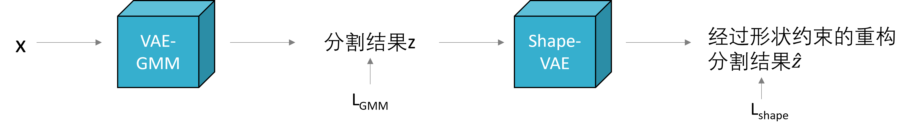
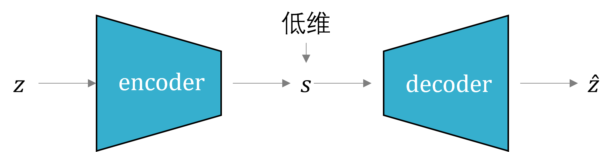

# shape-VAE + VAE-GMM

## 背景

1.动机：现有的 VAE-GMM 缺乏对目标形状的连续性约束，导致生成的形状不够平滑和自然。
2.方法：引入 shape-VAE（轻量级），针对分割结果生成目标形状。

## 架构

## shape-VAE

<!--  -->

1. $ELBO_{shape}$ = $E_{q(s|z)}[log p(z|s)] - KL(q(s|z) || p(s))$
    z 转成 distance transform map, signed distance transform map (SDF):
$$
    d(v) = \begin{cases}
        +dist(v, \delta z) & v 在内部 \\
        -dist(v, \delta z) & v 在外部
    \end{cases}
$$

$$
\begin{cases}
    边界 = 0\\
    内部 > 0\\
    外部 < 0
\end{cases}
$$

+ 有三个分割目标，就有三个SDF map，分别对应三个分割目标的边界。
+ z 用 groundtruth 做预训练样本

2. $q(s|z) = \mathcal{N}(s; \mu_{\phi}(z), \Sigma_{\phi}(z))$

解码器采样 $q(s|z)$，重构与 z 对应的 SDF

$$
    \hat{z} = Decoder(s)
$$

$\hat{z}$ 再转换成Mask
$$
    Mask(x, y) = \begin{cases}
        1 & \hat{z}(x, y) \ge 0 \\
        0 & \hat{z}(x, y) < 0
    \end{cases}
$$

3. 先验 $p(s)$
对 groundtruth 的 Mask 进行 PCA 建模。（少量groundtruth）
SDF 样本 $v_1, v_2, \ldots, v_n$
计算均值形状：$\overline{v} = \frac{1}{n} \sum_{i=1}^n v_i$
构造协方差矩阵
SVD 求主分量 k 个，${\{\lambda_i\}}_{i=1}^k$
$P(s_j) = \mathcal{N}( 0, \lambda_j)$ （前提是中心对齐）

> k 是 s 的维度，低维

4. shape-VAE 预训练
groundtruth的 z （不含先验用的样本）训练shape-VAE

## VAE-GMM 与 shape-VAE 联合训练

$L_{total} = L_{GMM} + \lambda L_{shape}$

其中，$\lambda$ 初期较大，后期逐渐减小